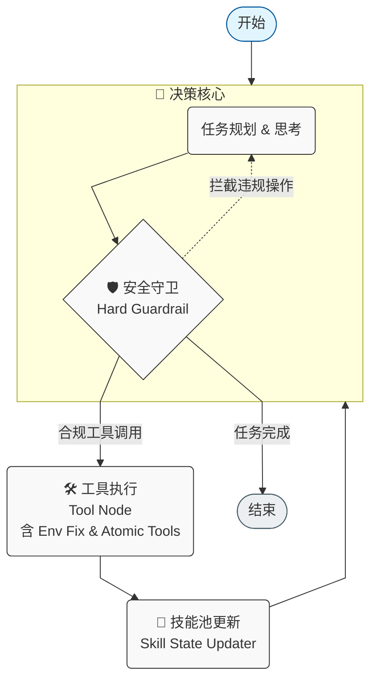

# 🤖 模块化智能体 CLI (Modular Agent CLI)

[](https://www.python.org/downloads/)
[](https://github.com/langchain-ai/langgraph)
[](LICENSE)

这是一个基于 **LangGraph** 构建的高性能、模块化智能体命令行工具。它采用“模型中立”架构，深度适配 **DeepSeek (通过火山引擎)**、**OpenAI** 等主流大模型，专为中文开发者环境设计。

## ✨ 核心亮点

### 🎨 电影级终端交互 (Cinema-grade UI)
告别枯燥的纯文本流。
*   **流式 Markdown**：思考过程如黑客帝国般实时渲染，支持代码高亮、表格和富文本。
*   **动态状态反馈**：清晰的 Spinner 动画展示 Agent 的“思考”与“行动”状态。
*   **结构化面板**：工具调用参数与执行结果通过彩色面板（Panel）结构化展示，一目了然。

### 🔧 原子文件操作 (Atomic Operations)

### 🔧 灵活的模型切换 (Provider Agnostic)
内置动态模型加载机制。只需通过环境变量，即可一键从 OpenAI 切换至 DeepSeek (Ark) 或其他兼容 OpenAI API 的提供商，无需修改任何核心代码。

### 🔌 动态技能插拔
Agent 采用“零预置”策略。当面临复杂任务时，Agent 会通过 `activate_skill` 动态加载本地技能描述文件。系统强制执行“先加载、再执行”的严谨时序。

---

## 🏗️ 系统架构

系统基于 LangGraph 的有向无环图 (DAG) 架构，内置多重安全与自愈机制：



*   **决策核心**：负责规划任务、生成思考内容。内置**安全守卫**，物理拦截违规操作。
*   **工具执行**：执行 Shell 命令、文件读写或激活技能。内置**环境自修复**，自动重定向 Python 环境。
*   **技能池更新**：拦截技能激活事件，实时扩展 Agent 的能力边界。

---

## 🚀 快速开始

### 1. 环境初始化
推荐使用 Python 3.10 及以上版本。

```bash
# 创建并激活虚拟环境
python3 -m venv venv
source venv/bin/activate

# 安装核心依赖
pip install -r requirements.txt
```

### 2. 配置模型 (以 DeepSeek/火山引擎为例)
通过环境变量配置模型。我们推荐将这些配置添加到您的 `~/.zshrc` 或 `~/.bashrc` 中。

```bash
# 火山引擎方舟接入点 URL
export LLM_BASE_URL="https://ark.cn-beijing.volces.com/api/v3"
# 您部署的 Endpoint ID (如 ep-2025...)
export LLM_MODEL_NAME="your-endpoint-id"
# 您的 API Key
export LLM_API_KEY="your-api-key"
```

*注：若未配置上述变量，系统默认使用 `OPENAI_API_KEY` 并调用 `gpt-4o-mini`。*

### 3. 运行体验
```bash
python3 main.py
```

---

## 🧩 技能生态 (Skills)

项目通过目录结构定义技能，实现零成本扩展：

*   `web_scraper`: 基于 BeautifulSoup 的自动化网页图片抓取。
*   `image_to_pdf`: 基于 Pillow 的多格式图片转 PDF 工具。
*   `deep-coder`: 针对复杂 Bug 修复的深度编码模式（实验性）。

### 如何添加新技能？
1. 在 `skills/` 下新建目录。
2. 编写 `SKILL.md`：描述技能入口、API 参数及脚本路径。
3. 在 `scripts/` 下放置你的 Python 或 Shell 脚本。

---

## 🛠️ 开发者指南

本项目遵循 [PEP 8](https://www.python.org/dev/peps/pep-0008/) 代码风格规范。在贡献代码前，请确保：
1.  **注释中文化**：所有新增函数必须包含中文 Docstring。
2.  **运行语法检查**：
    ```bash
    python3 -m py_compile **/*.py
    ```

## 📄 开源协议
本项目采用 [MIT License](LICENSE) 开源协议。
