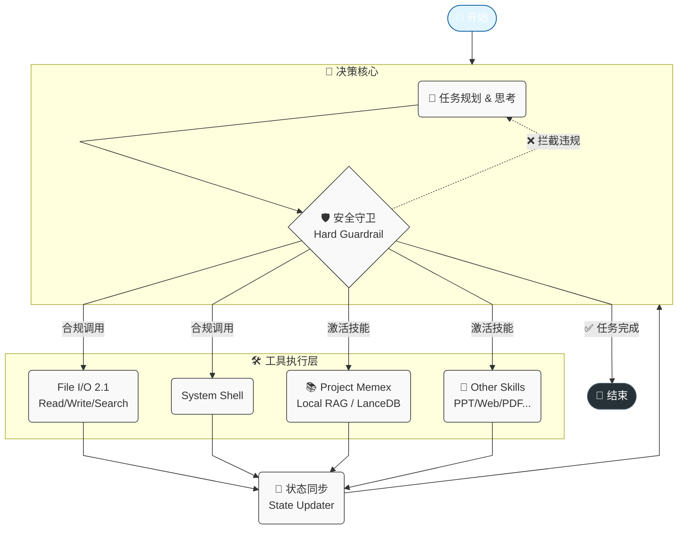

# 🤖 Modular Agent CLI (代号: Gemini)

[](https://www.python.org/downloads/)
[](https://github.com/langchain-ai/langgraph)
[](LICENSE)

> **"不仅仅是命令行工具，而是你的私有化数字员工。"**

Modular Agent CLI 是一个基于 **LangGraph** 构建的企业级智能体终端。它专为 **复杂任务处理** 设计，具备 **Office文档深度解析**、**本地向量记忆 (RAG)** 和 **原子化工具链**，旨在成为售前顾问、开发者和分析师的得力助手。

---

## ✨ 核心特性 (Core Features)

### 🧠 本地知识中枢 (Project Memex)
Agent 不再是“失忆”的工具人，它拥有了私有化、可成长的长期记忆。
*   **私有 RAG 底座**：基于 **LanceDB** + **BGE-M3** 构建的本地向量引擎，无需联网，数据不出域。
*   **全格式入库**：一键将 PDF、Word、Excel、PPT 存入大脑，保留文档结构与图片占位。
*   **生产级防御**：内置 **Schema 自动迁移** 机制，当数据库结构升级时自动平衡，确保系统永不因数据冲突崩溃。
*   **溯源机制**：每一次回答都带有精确的 `[Source: File, Loc: Slide/Page, Line: X-Y]` 引用，拒绝幻觉。

### 📄 企业级文件 I/O (File I/O 2.1)
不仅仅是读写文本，我们构建了一套文件操作的“瑞士军刀”：
*   **Office 原生支持**：直接读取 `.docx`、`.pdf`、`.xlsx`、`.pptx`。特别针对 PPT 优化，可深度提取**隐藏的演讲者备注 (Notes)**。
*   **智能大纲导航**：对于长文档（如白皮书），Agent 会先读取大纲（TOC），再通过行号精准定位章节，拒绝 Token 浪费。
*   **全文搜索 (Grep-like)**：内置 `search_file` 工具，毫秒级定位关键指标（如 "QPS", "报价"）。
*   **原子编辑**：使用 `replace_in_file` 进行基于上下文的精准替换。

### 🎨 3. 电影级终端交互 (Cinema UI)
*   **流式 Markdown**：思考过程如黑客帝国般实时渲染。
*   **动态状态反馈**：清晰的 Spinner 动画展示 "思考" 与 "行动" 状态。
*   **结构化面板**：工具调用参数与执行结果通过彩色面板（Panel）结构化展示。

### 🔌 4. 动态技能插拔
*   Agent 采用“零预置”策略。通过 `activate_skill` 动态加载本地技能（如 `web_scraper`, `ppt_master`）。
*   架构解耦，随时扩展新能力而不影响核心稳定性。

---

## 🏗️ 系统架构

系统基于 LangGraph 的有向无环图 (DAG) 架构，深度集成了本地知识库与安全守卫：



*   **决策核心**：负责意图识别与任务拆解。内置**安全守卫**，物理拦截高危操作。
*   **工具执行层**：
    *   **File I/O 2.1**：Office/PDF 解析、大纲导航、原子搜索。
    *   **Project Memex**：基于 LanceDB 的本地知识库检索。
*   **状态同步**：将工具执行结果（如 RAG 检索到的 Context）回传给 Agent。

---

## 🚀 快速开始 (Quick Start)

### 1. 环境准备
推荐使用 Python 3.10+。

```bash
# 克隆项目
git clone https://github.com/your-repo/agent-cli.git
cd agent-cli

# 创建虚拟环境
python3 -m venv venv
source venv/bin/activate

# 安装依赖 (含 RAG 和 Office 支持)
pip install -r requirements.txt
```

### 2. 配置模型
支持 **OpenAI**、**DeepSeek (火山引擎)** 等所有兼容 OpenAI 格式的 API。
建议添加到 `~/.zshrc` 或 `~/.bashrc`：

```bash
# 示例：使用火山引擎 (DeepSeek)
export LLM_BASE_URL="https://ark.cn-beijing.volces.com/api/v3"
export LLM_MODEL_NAME="ep-2025xxxx-xxxxx"  # 您的 Endpoint ID
export LLM_API_KEY="your-api-key"
```

### 3. 启动
```bash
python3 main.py
```

---

## 💡 实战场景 (Use Cases)

### 场景一：售前方案生成
> **用户**: "我是售前顾问。请阅读 `demo_materials` 里的客户需求文档和我们的产品白皮书，写一份针对性的解决方案。"

**Agent 动作**:
1.  调用 `read_file` 扫描 Docx/PPT，提取客户痛点 (KPIs)。
2.  调用 `search_file` 在白皮书中检索对应的技术指标（如 "TPS", "延迟"）。
3.  调用 `read_file` 读取 Excel 报价单。
4.  调用 `write_file` 生成结构化的 `solution.md`。

### 场景二：企业知识库问答
> **用户**: "把 `2025_Q1_报价单.xlsx` 存入知识库。然后告诉我 Nebula 引擎多少钱？"

**Agent 动作**:
1.  调用 `activate_skill("knowledge_base")`。
2.  执行 `ingest.py` 将 Excel 切片入库（LanceDB）。
3.  执行 `query.py` 检索 "Nebula 引擎 价格"。
4.  回答: "根据报价单，Nebula Core 引擎基础包为 50,000元/CPU/年 [Source: 2025_Q1_报价单.xlsx]"。

---

## 📂 目录结构

```
agent-cli/
├── agent_core/          # [核心] LangGraph 智能体逻辑
│   ├── tools.py         # 核心工具 (Read/Write/Search/Run)
│   └── ...
├── cli/                 # [交互] UI 渲染与异步线程
├── skills/              # [扩展] 技能插件包
│   ├── knowledge_base/  # Project Memex (RAG)
│   ├── ppt_master/      # PPT 生成
│   └── ...
├── tests/               # [测试] 自动化测试套件
└── main.py              # 启动入口
```

## 🛠️ 开发者指南

本项目遵循 [PEP 8](https://www.python.org/dev/peps/pep-0008/) 代码风格规范。
贡献代码前，请运行测试：

```bash
# 运行 RAG 集成测试
python3 tests/test_skill_knowledge_base.py

# 运行文件 IO 测试
python3 tests/test_io_v2_advanced.py
```

## 📄 开源协议
MIT License