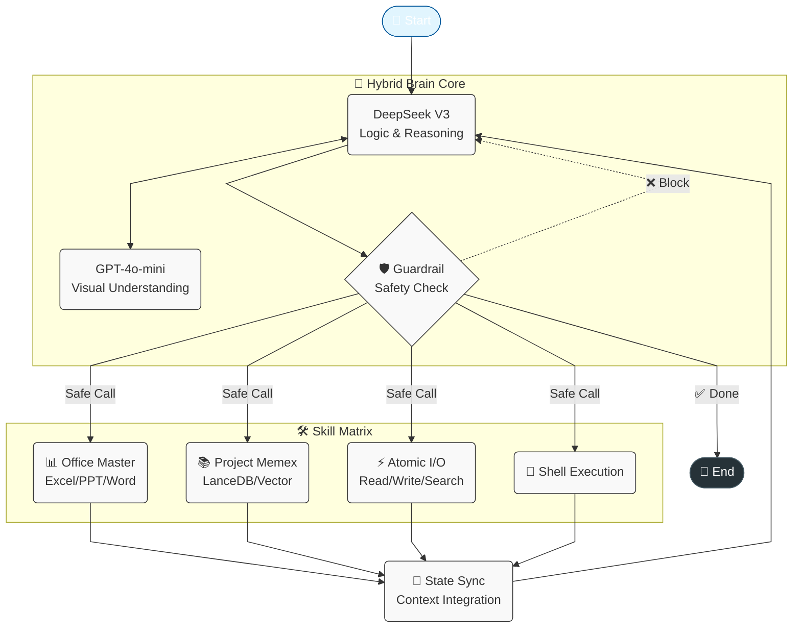

# 🤖 Modular Agent CLI (代号: Gemini)

[](https://www.python.org/downloads/)
[](https://github.com/langchain-ai/langgraph)
[](LICENSE)

> **"不仅仅是命令行工具，而是你的全栈数字员工。"**

Modular Agent CLI 是一个基于 **LangGraph** 构建的企业级智能体终端。它专为 **复杂任务处理** 设计，集成了 **混合多模态架构**、**本地知识库 (RAG)** 和 **办公自动化 (Office Automation)** 能力，能够胜任数据分析师、售前顾问和全栈开发者的工作。

---

## ✨ 核心特性 (Core Features)

### 🧠 混合多模态架构 (Hybrid Multi-modal)
系统创新性地采用了 **"双脑"** 协同模式，兼顾成本与能力：
*   **大脑 (Brain)**：由 **DeepSeek V3** (或任意高智商文本模型) 负责逻辑推理、任务拆解和代码生成。
*   **眼睛 (Eyes)**：由 **GPT-4o-mini** (或兼容视觉模型) 负责图像理解。即使主模型不支持视觉，Agent 也能通过 `describe_image` 工具“看懂”本地图片。
*   **配置解耦**：支持通过 `.env` 分别配置主模型和视觉模型，灵活应对不同厂商接口。

### 📊 办公自动化大师 (Office Master)
我们重新定义了 CLI 处理办公文档的能力：
*   **Excel 自动化 (`excel_master`)**：
    *   将 JSON/CSV 数据转换为带样式的专业 Excel 报表。
    *   自动调整列宽、表头着色、多表单管理。
    *   支持基础统计计算（求和、平均等）。
*   **PPT 智能生成 (`ppt_master`)**：
    *   基于 Markdown 剧本一键生成企业级 PPT。
    *   **图文混排**：支持识别 Markdown 中的 `` 语法，将本地图片精准插入幻灯片。
    *   **演讲备注**：自动提取 Speaker Notes，辅助演示。
*   **全能文件 I/O**：深度解析 `.docx`, `.pdf`, `.pptx`, `.xlsx`，支持大纲导航与全文搜索。

### 🧠 本地知识中枢 (Project Memex)
*   **私有 RAG**：基于 **LanceDB** + **BGE-M3** 构建的本地向量引擎。
*   **全生命周期管理**：支持文档入库、自动归档、版本溯源和 Schema 自愈。
*   **情景记忆**：对话历史自动存入向量库，Agent 拥有“超长短期记忆”。

---

## 🏗️ 系统架构

系统基于 LangGraph 的有向无环图 (DAG) 架构，深度集成了 **混合双脑模型** 与 **安全守卫**：



*   **混合双脑 (Hybrid Brain)**：
    *   **DeepSeek V3**：负责逻辑主控、任务拆解与工具调度。
    *   **GPT-4o-mini**：作为“视觉皮层”，负责解析图像并向主脑提供语义描述。
*   **安全守卫 (Guardrail)**：物理拦截高危操作（如 rm -rf /）。
*   **技能矩阵 (Skill Matrix)**：
    *   **Office Master**：Excel/PPT 自动化专家。
    *   **Project Memex**：基于 LanceDB 的长期记忆检索。

---

## 🚀 快速开始 (Quick Start)

### 1. 环境准备
```bash
# 克隆项目
git clone https://github.com/your-repo/agent-cli.git
cd agent-cli

# 创建虚拟环境
python3 -m venv venv
source venv/bin/activate

# 安装全量依赖 (含 Pandas, RAG, Office, DotEnv)
pip install -r requirements.txt
```

### 2. 配置模型 (.env)
推荐在项目根目录创建 `.env` 文件（已自动忽略，不提交 Git）：

```ini
# --- 大脑配置 (DeepSeek V3 / Claude / GPT-4) ---
LLM_BASE_URL=https://ark.cn-beijing.volces.com/api/v3
LLM_MODEL_NAME=ep-2025xxxx-xxxxx
LLM_API_KEY=your-deepseek-key

# --- 眼睛配置 (Vision Model, 推荐 gpt-4o-mini) ---
VISION_LLM_BASE_URL=https://api.openai.com/v1
VISION_LLM_MODEL_NAME=gpt-4o-mini
VISION_LLM_API_KEY=your-openai-key
```

### 3. 启动
```bash
python3 main.py
```

---

## 💡 实战场景 (Use Cases)

### 场景一：全链路报表自动化
> **用户**: "读取 `sales_data.json` 生成一份 Excel 报表，然后基于报表数据写一个 PPT 汇报，把 `chart.png` 插进去。"

**Agent 动作**:
1.  **数据处理**：激活 `excel_master`，清洗 JSON 数据，生成带样式的 `report.xlsx`。
2.  **视觉分析**：调用 `describe_image` 查看 `chart.png`，理解图表含义。
3.  **PPT 制作**：激活 `ppt_master`，撰写包含图表分析的 Markdown 剧本，并引用 `chart.png`。
4.  **最终产出**：生成图文并茂的 `presentation.pptx`。

### 场景二：企业知识库问答
> **用户**: "把 `2025_Q1_报价单.xlsx` 存入知识库。然后告诉我 Nebula 引擎多少钱？"

**Agent 动作**:
1.  调用 `activate_skill("knowledge_base")`。
2.  执行 `ingest.py` 将 Excel 切片入库（LanceDB）。
3.  执行 `query.py` 检索 "Nebula 引擎 价格"。
4.  回答: "根据报价单，Nebula Core 引擎基础包为 50,000元/CPU/年 [Source: 2025_Q1_报价单.xlsx]"。

---

## 🛠️ 开发者指南

### 测试金字塔
本项目拥有完备的自动化测试体系：

```bash
# 1. 单元与功能测试 (Unit Tests)
# 覆盖工具链、RAG 生命周期、文件 IO、Excel 生成等
python3 -m unittest discover tests -p "test_*.py"

# 2. 全量回归测试 (E2E Regression)
# 模拟真实业务流：Excel -> PPT (含图片) -> 结果验证
python3 tests/test_e2e_v3_full.py
```

### 目录结构
```
agent-cli/
├── agent_core/          # [核心] LangGraph 逻辑 & State
├── cli/                 # [交互] Rich UI & Async Worker
├── skills/              # [插件]
│   ├── excel_master/    # [New] Excel 自动化
│   ├── ppt_master/      # [Upgraded] PPT 生成 (含图片支持)
│   ├── knowledge_base/  # RAG 引擎
│   └── ...
├── tests/               # [保障] 全链路测试脚本
└── .env                 # [配置] 模型密钥 (用户自建)
```

## 📄 开源协议
MIT License